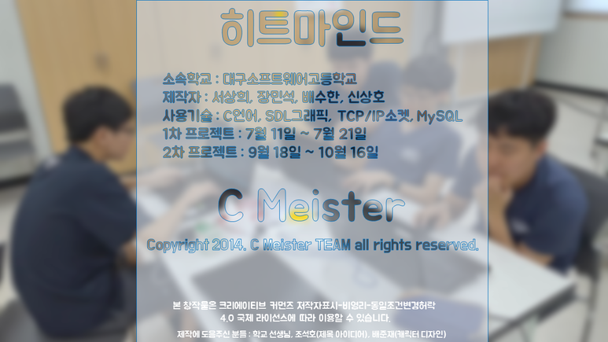
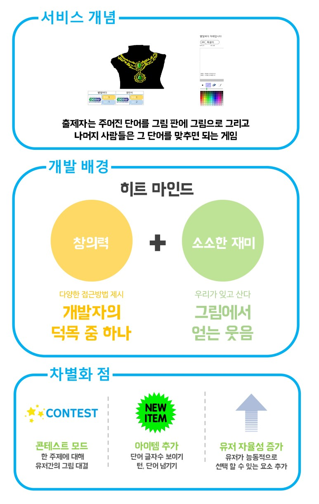

# Hitmind

## 개요
  
[히트마인드 버전1](https://github.com/tbvjaos510/HitmindVer_1)을 재개발하여 만든 게임입니다. 

## 팀원

[대구소프트웨어고등학교](http://www.dgsw.hs.kr/index.do) 학생들로 구성된 4인 팀입니다.

| Name | Part | Blog |
|:---|:---|:---|
| [서상희](https://github.com/tbvjaos510) | 기획, 데이터베이스, 네트워크 | https://blog.naver.com/dgsw102 | 
| [배수한](https://github.com/tbvjaos510) | 기획, 디자인, 프론트엔드 보조개발 | https://blog.naver.com/soohan530 |
| [장민석](https://github.com/msjang4) | 프론트엔드 메인개발 | https://blog.naver.com/msjang4 |
| [신상호](https://github.com/ShinSH0) | 네트워크 | https://blog.naver.com/dgsw102 |

## 외부링크
- [히트마인드 발표회 시연 영상](https://www.youtube.com/watch?v=6cnmCnySCeQ)
- [히트마인드 플레이 영상](http://blog.naver.com/soohan530/221126755562)
- [SDL 사용준비 방법](https://blog.naver.com/msjang4/221220380428)
- [MySQL 사용준비 방법](https://blog.naver.com/dgsw102/221014854770)
- [히트마인드 관련 포스팅 - 배수한](https://blog.naver.com/PostList.nhn?blogId=soohan530&from=postList&categoryNo=15)
- [히트마인드 관련 포스팅 - 장민석](https://blog.naver.com/msjang4/221153693317)
